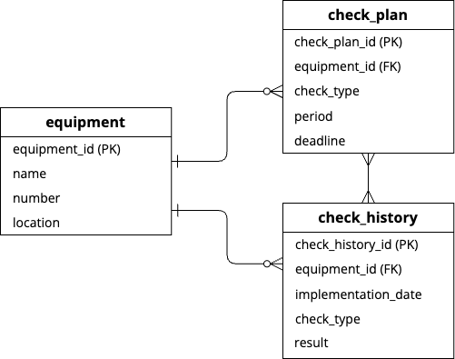
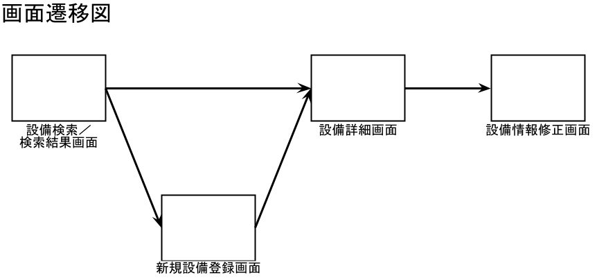

# 設備点検管理アプリ

## アプリ概要
- 工場やプラントで使用されている設備（例：ポンプ、弁、電源盤、etc）の点検履歴や点検期限を管理できるアプリ。
- 以下の情報を持ち、それぞれ登録、修正、削除ができる。  
また、いくつかの項目で設備検索ができる。
  - 設備情報（設備名称、設備番号、設置場所）
  - 点検計画（点検内容、点検周期、点検期限）
  - 点検実績（点検日、点検内容、点検結果）

## 作成背景
前職で設備の保全業務を行なっており、設備情報や点検情報が一元化されたシステムを使用していましたが、
システムが複雑で使いにくいという問題点がありました。  
そこで、最低限の機能だけを実装した、誰でも簡単に操作できる設備点検管理アプリを作成してみようと思いました。

## 設計書
### E-R図（完成イメージ）

### 画面遷移図（完成イメージ）

### API仕様書
[SwaggerによるAPI仕様書](https://rinna-kawaguchi.github.io/Equipment-Management-API/dist/index.html)
