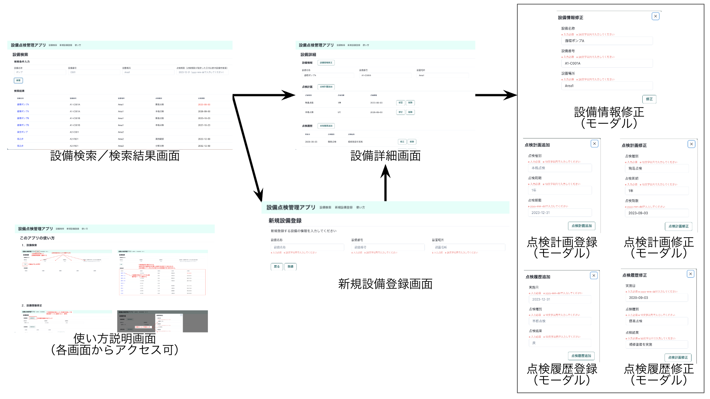

# 設備点検管理アプリ

## アプリ概要
- 工場やプラントで使用されている設備（例：ポンプ、弁、電源盤、etc）の点検履歴や点検期限を管理できるアプリ。
- 以下の情報を持ち、それぞれ登録、修正、削除ができる。  
また、いくつかの項目で設備検索ができる。
  - 設備情報（設備名称、設備番号、設置場所）
  - 点検計画（点検内容、点検周期、点検期限）
  - 点検実績（点検日、点検内容、点検結果）
- 点検期限の１ヶ月前になると、対象設備の設備情報と点検期限を知らせるメールが送付される。

## 作成背景
前職で設備の保全業務を行なっており、設備情報や点検情報が一元化されたシステムを使用していましたが、
システムが複雑で使いにくいという問題点がありました。  
そこで、使いやすい簡単なアプリを自分で作成してみようと思いました。  

## 主な使用技術
- バックエンド：Java, Spring Boot
- フロントエンド：React (TypeScript), Chakra UI
- その他：
  - MySQL 
  - Docker 
  - 自動テスト 
  - CI (CheckStyle, 自動テストを実行)
  - AWSデプロイ（これから実施予定）

## アプリケーション概略図

## アプリケーション機能一覧

| 項目     | 概要                                         |
|--------|--------------------------------------------|
| メール通知  | 点検期限の１ヶ月前になると、対象設備の設備情報と点検期限を知らせるメールが送付される |
| 検索     | 設備名称、設備番号、設置場所、点検期限による検索ができる               |
| 詳細表示   | 指定した設備の設備情報、点検計画、点検履歴が表示される                |
| 設備登録   | 設備の新規登録ができる                                |
| 設備情報修正 | 指定した設備の設備情報の修正ができる                         |
| 点検計画変更 | 指定した設備の点検計画の追加・修正・削除ができる                   |
| 点検履歴変更 | 指定した設備の点検履歴の追加・修正・削除ができる                   |
| 設備削除   | 指定した設備の設備情報・点検計画・点検履歴の削除ができる               |

## 設計書
### E-R図

### 画面遷移図

### API仕様書
[SwaggerによるAPI仕様書](https://rinna-kawaguchi.github.io/Equipment-Management-API/dist/index.html)

## ローカルでのアプリケーション起動方法
- Git, Java, Node.Js, Dockerをインストールする。
- リポジトリをgit cloneする。  
  `git clone https://github.com/rinna-kawaguchi/Equipment-Management-API.git`  

- クローンしたディレクトリに移動する。  
- Dockerを起動する。  
`docker compose up`  
- Spring Bootを起動する。  
  `./gradlew bootRun`  
- frontendディレクトリに移動する。  
  `cd frontend/`  
- 依存関係をインストールし、Reactのアプリケーションを起動する。  
  `npm install`
  `npm start`  
  （yarnがインストールされている場合は下記コマンドでも可）   
  `yarn`  
  `yarn start`  
- ブラウザが立ち上がるので、URLのパスに`/find`を入力すると、設備検索画面が表示される。

## 自動テスト
以下のテストコードを実装。
- 単体テスト
  - EquipmentServiceImpl, PlanServiceImpl, HistoryServiceImpl
  - EquipmentMapper, PlanMapper, HistoryMapper
- 結合テスト
  - EquipmentController, PlanController, HistoryController  

自動テストの実行結果  

## 作成スケジュール
#### 当初の計画  
  

#### 実績（8月4日時点）  
  

#### 進捗状況の振り返り 
当初２週間程度で作成する予定でしたが、結果的には１ヶ月程度かかってしまいました。  
 
反省点
- フロント側の実装時間の想定が甘かった  
  → フロント側はバック側に比べて学習歴が浅く、思ったよりも時間がかかりました。
もっと自分の力量を見極めて計画を作成しなければいけないと感じました。
- 追加したい機能がどんどん出てきてしまった  
  → 最低限の機能を実装したあと、追加したい機能や、修正したい箇所がどんどんでてきてしまいました。
まだ知識が浅いため、ひとつひとつを実現するのに時間がかかり、結果的に大幅な遅れに繋がってしまいました。
より良くするための改善ではあったものの、最低ラインまでできたら一旦リリースし、後から修正を加えていく方がよかったと感じました。  

## 今後の展望
- 追加機能の実装 [(Issues)](https://github.com/rinna-kawaguchi/Equipment-Management-API/issues)
- Spring Securityの導入
- CDの導入
- フロント側の自動テスト
- フロント側のさまざまなスタイル調整
